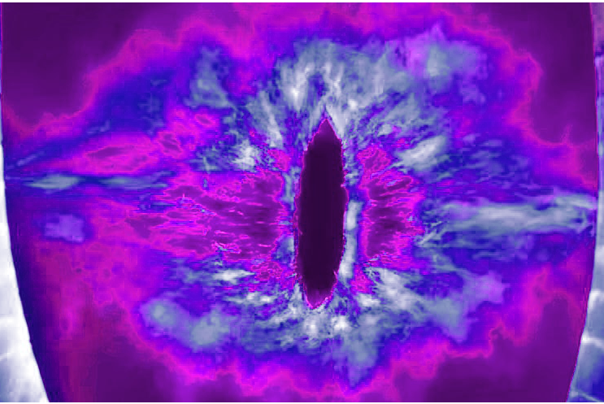

# openObserver

## About openObserver

openObserver is a system and framework for building embeded systems that run machine learning models. This specific repository contains code that will run object tracking. It is designed to be extensible so newer steps can be added in to achieve your goals.

## Getting Started

1. Create a new virtual environment

1. Download project dependencies `OpenCV`(install complete opencv)  and `apt-get install libzmq3-dev`

1. `pip3 install -r requirements.txt`

1. Download the yolov4 onnx model from the onnx [models](https://github.com/onnx/models/tree/master/vision/object_detection_segmentation/yolov4). Also retrieve the require `coco.names` and `yolov4_anchors.txt` file.

1. In the resources directory and places the files from the previous step in there.

1. From the root directory, run `python3 main.py`

## Special Thanks

This project was heavily inspired by the [openpilot](https://github.com/commaai/openpilot) project developed by comma.ai. It uses a lot of the same tools and architecture
